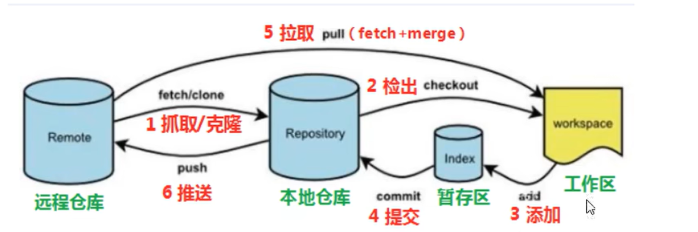
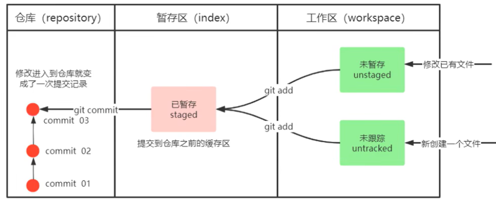
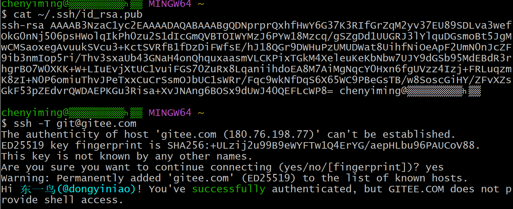
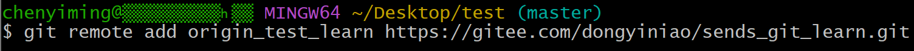
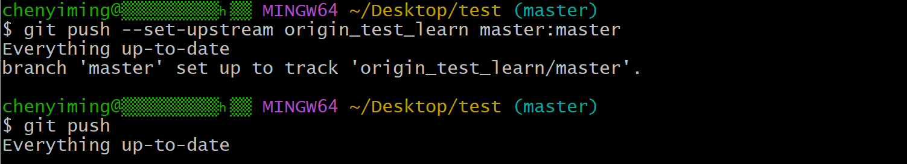
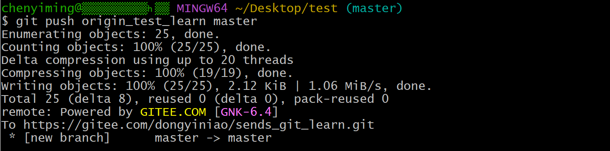
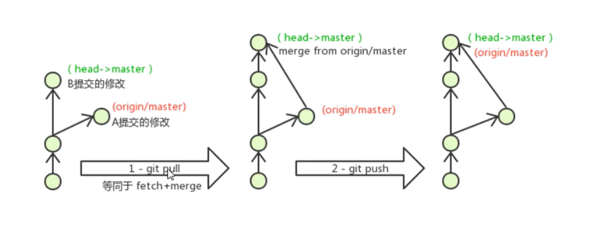

# Git

## Git工作流程图



**命令如下**：

1. **clone**（克隆）：从远程仓库中克隆代码到本地仓库。

2. **checkout**（检出）：从本地仓库中检出一个仓库分支然后进行修订。
3. **add**（添加）：在提交前先将代码提交到暂存区。
4. **commit**（提交）：提交到本地仓库。本地仓库中保存修改的各个历史版本。
5. **fetch**（抓取）：从远程库，抓取到本地仓库，不进行任何的合并动作，一般操作比较少。
6. **pull**（拉取）：从远程仓库拉到本地库，自动进行合并（merge），然后放到工作区，相当于`fetch+merge`。
7. **push**（推送）：修改完成后，需要和团队成员共享代码时，将代码推送到远程仓库。

## 一、Git环境配置

### 1、Git基础配置

1. **打开Gitbash**

2. **设置用户信息**

   ```
   git config --global user.name "youname"
   git config --global user.email "youemail"
   ```

3. **查看配置信息**

   ```
   git config --global user.name
   git config --global user.email
   ```

### 2、为常用指令配置别名（可选）

有些常用指令参数较多，每次都要输入好多参数，我们可以使用别名。

1. **打开用户目录，创建`.bashrc`文件**

   打开gitBash，执行`touch ~/.bashrc`

2. **在`.bashrc`文件中输入如下内容。**

   ```
   #用于输出git提交日志
   alias git-log='git log --pretty=oneline --all --graph --abbrev-commit'
   #用于输出当前目录所有文件及基本信息
   alias ll='ls -al'
   ```

3. **打开gitBash，执行`source ~/.bashrc`**

### 3、解决GitBash乱码问题

1. **打开GitBash执行下面问题**

   ```
   git config --global core.quotepath flash
   ```

   在 Git 中，路径名中的非 ASCII 字符通常会以 UTF-8 编码表示。如果设置了 `core.quotepath` 选项，Git 将尽可能地对路径名进行转义和引用，以确保输出是可读的。将 `core.quotepath` 设置为字符串 "flash"。这可能会导致 Git 输出路径时采用一种特殊的引用或转义方式，以便更好地处理非 ASCII 字符。

2. **在`${git_home}/etc/bash.bashrc`文件最后加入下面两行**

   ```
   export LANG="zh_CN.UTF-8"
   export LC_ALL="zh_CN.UTF-8"
   ```

   1. `export LANG="zh_CN.UTF-8"`:
      - `LANG` 是一个环境变量，用于指定系统默认的语言环境。
      - 在这里，将 `LANG` 设置为 "zh_CN.UTF-8"，意味着将系统的语言环境设置为中文（中国）并使用 UTF-8 编码。
   2. `export LC_ALL="zh_CN.UTF-8"`:
      - `LC_ALL` 是另一个环境变量，用于设置程序的本地化环境。
      - 同样，将 `LC_ALL` 设置为 "zh_CN.UTF-8"，这表示设置程序的本地化环境为中文（中国）并使用 UTF-8 编码。

   这些设置对于确保在终端或命令行中正确显示中文字符是很重要的。在 Git 中，这可能会影响输出的语言和编码。确保这些设置与您系统和终端的实际需求相匹配。

## 二、Git的常用命令

### 1、基础操作

1. **仓库初始化**

   -  创建目录`git_test01`并在目录下打开`gitbash`

   -  初始化`git`仓库：`git init`

2. **创建文件并提交**

   - 目录下创建文件`file01.txt`：`touch file01.txt`。

   - 查看状态`git status`。

   - 将修改加入暂存区：`git add .`。

   - 将修改提交到本地仓库，提交记录内容为：`commit 001`。

     ```
     git commit -m 'commit 001'
     ```

   - 查看日志：`git log`

     

3. **修改文件并提交**

   -  修改file01的内容为：`count=1`使用`vi file01`

   - 将修改加入暂存区`git add .`。

   - 将修改提交到本地仓库，提交记录内容为：`update file01`

     ```
     git commit --m 'update file01'
     ```

   - 查看日志`git log`

   - 以精简的方式显示提交记录`git-log` 

4. **将最后一次修改还原**

   -  查看提交记录`git-log`

   - 找到倒数第2次提交的`commitID`。

   - 版本回退

     ```
     git reset commitID --hard
     ```

5. **编写`gitignore`**

   ```
   #no .a files
   *.a
   #but do track lib.a, even though you're ignoring .a files above
   !lib.a
   #only ignore the TODO file in the current directory, not subdir/TODO
   /TODO
   #ignore all files in the build/ directory
   build/
   #ignore doc/notes.txt, but not doc/server/arch.txt
   doc/*.txt
   #ingore all .pdf files in the doc/ directory
   doc/**/*.pdf
   ```

### 2、分支

几乎所有的版本控制系统都以某种形式支持分支。使用分支意味着你可以把你的工作从开发主线上分离开来进行重大的Bug修改、开发新功能，以免影响开发主线。

1. **查看本地分支**`git branch`。

2. **创建本地分支**`git branch 分支名`

3. **切换分支(checkout)**

   - 命令：`git checkout 分支名`

   - 直接切换到一个不存在的分支(创建并切换)

     命令：`git checkout -b 分支名`

4. **合并分支(merge)**

   一个分支上的提交可以合并到另一个分支

   命令：`git merge 分支名称`

5. **删除分支**

   **不能删除当前分支，只能删除其他分支**

   `git branch -d b1`删除分支时，需要做各种检查

   `git branch -D d1`不做任何检查，强制删除。

6. **解决冲突**

   当两个分支上对文件的修改可能会存在冲突，例如同时修改了同一个文件的同一行，这时就需要手动解决冲突，解决冲突步骤如下：

   - 处理文件中冲突的地方
   - 将解决完冲突的文件加入暂存区(add)
   - 提交到仓库(commit)

7. **开发中分支使用的原则与流程**

   几乎所有的版本控制系统都以某种形式支持分支。使用分支意味着你可以把你的工作从开发主线上分离开来进行重大Bug修改、开发新的功能，以免影响开发主线。 

   在开发中，一般有如下分支使用原则与流程：

   * `master`(生产)分支

     线上分支，主分支，中小规模项目作为线上运行的应用对应的分支

   * `develop`(开发)分支

     是从master创建的分支，一般作为开发部门的主要开发分支，如果没有其他并行开发不同期上线要求，都可以在此版本进行开发，阶段开发完成后，需要是合并到master分支，准备上线。

   * `feature`/`xxxx`分支

     从develop创建的分支，一般是同期并行开发，但不同期上线时创建的分支，分支上的研发任务完成后合并到develop分支。

   * `hotfix/xxxx`分支

     从master派生的分支，一般作为线上bug修复使用，修复完成后需要合并到master、test、develop分支。

   * 还用一些其他分支，在此不再详述，例如`test`分支（用于代码测试）、`pre`分支（预上线分支）等等。

     

## 三、Git远程仓库

### 以Gitee仓库为例

Git 全局设置:

```
git config --global user.name "东一鸟"
git config --global user.email "14026157+dongyiniao@user.noreply.gitee.com"
```

创建 git 仓库:

```
mkdir sends_git_learn
cd sends_git_learn
git init 
touch README.md
git add README.md
git commit -m "first commit"
git remote add origin https://gitee.com/dongyiniao/sends_git_learn.git
git push -u origin "master"
```

已有仓库?

```
cd existing_git_repo
git remote add origin https://gitee.com/dongyiniao/sends_git_learn.git
git push -u origin "master"
```

#### **1、配置SSH公钥**

- 生成**SSH**公钥

  ```
  ssh-keygen -t rsa         
  ```

  不断回车：如果公钥已存在，则自动覆盖。

- **Gitee**设置账户公钥

  - 获取公钥：`cat ~/.ssh/id_rsa.pub` 

- 验证配置是否成功

  - `ssh -T git@gitee.com`

  

#### 2、操作远程仓库

1. **添加远程仓库**

   **此操作是先初始化本地仓库，然后与已创建的远程库进行对接。**

   - 命令：`git remote add <远端名称> <仓库路径>`

     - 远端名称，默认是`origin`，取决于远端服务器设置。

     - 仓库路径，从远端服务器获取此URL（统一资源定位器）。

     - 例如：`git remote add origin https://gitee.com/dongyiniao/sends_git_learn.git`

       

2. **查看远程仓库**

   - 命令：`git remote`

     

3. **推送到远程仓库**

   - 命令：`git push [-f] [--set-upstream] [远端名称[本地分支名][:远端分支名]]`

     - 如果远程分支名和本地分支名相同，则可以只写本地分支

       `git push origin master`

     - `-f`表示强制覆盖。

     - `--set-upstream`推送到远端同时并且建立起和远端分支的关联关系。

       `git push  --set-upstream origin master:master`

       如果**当前分支已经和远端分支关联，**则可以省略分支名和远端名。

       `git push`将master分支推送到已关联的远端分支。

     

4. **本地分支与远程分支的关联关系**

   - 查看关联关系我们可以使用`git branch -vv`命令

5. **从远程仓库克隆**

   如果已经有一个远端仓库，我们可以直接clone到本地。

   - 命令：`git clone <仓库路径> [本地路径]
     - 本地目录可以省略，会自动生成一个目录。

6. **从远程仓库中抓取和拉取**

   远程分支和本地分支一样，我们可以进行`merge`操作，只是需要先把远端仓库里的更新都下载到本地，在进行操作。

   - 抓取命令：`git fetch [remote name] [branch name]`
     - **抓取指令就是将仓库里的更新都抓取到本地，不会进行合并。**
     - 如果不指定远端名称和分支名，则会抓取所有分支。
   - 拉取命令：`git pull [remote name] [branch name]`
     - **拉取就是将远端仓库的修改拉取到本地并自动合并，等同于fetch+merge**
     - 如果不指定远端名称和分支名，则会抓取所有并更新当前分支。

7. **解决合并冲突**

   在一段时间，A、B用户修改了同一个文件，且同一行位置的代码，此时会发生合并冲突。 

   A用户在本地修改代码后有限推送到远程仓库，此时B用户在本地修改代码，提交到本地仓库后，也需要推送到远程仓库，此时B用户晚于A用户，**故需要先拉取远程仓库的提交，经过合并后才能推送到远端分支**，如下图所示：

   

   在B用户拉取代码时，因为A、B用户同一段时间修改了同一个文件的相同位置的代码，故会发生合并冲突。

   **远程分支也是分支，所以合并时冲突的解决方式也和解决本地分支冲突相同**。
