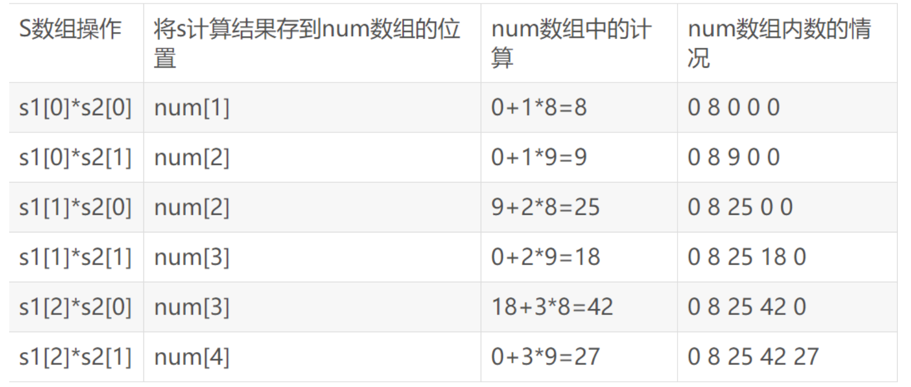
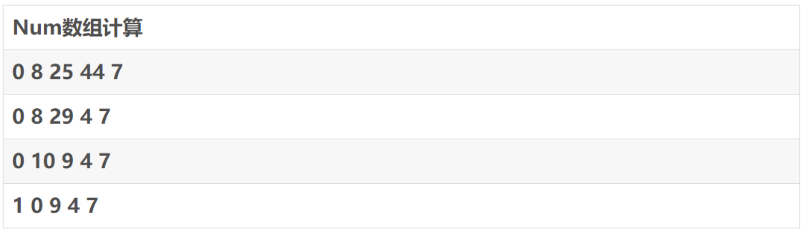

# 矩阵翻硬币

## 题目

#### 题目描述

小明先把硬币摆成了一个n行m列的矩阵。

随后,小明对每一个硬币分别进行一次Q操作。

对第X行第Y列的硬币进行Q操作的定义:将所有第i×X行,第j×Y列的硬币进行翻转。

其中i和j为任意使操作可行的正整数,行号和列号都是从1开始。

当小明对所有硬币都进行了一次Q操作后,他发现了一个奇迹:所有硬币均为正面朝上。

小明想知道最开始有多少枚硬币是反面朝上的。于是,他向他的好朋友小M寻求帮助。

聪明的小M告诉小明,只需要对所有硬币再进行一次Q操作,即可恢复到最开始的状态。然而小明很懒,不愿意照做。于是小明希望你给出他更好的方法。帮他计算出答案。

#### 输入描述

输入数据包含一行,两个正整数n,m,含义见题目描述。

其中,n、m≤101000。

#### 输出描述

输出一个正整数,表示最开始有多少枚硬币是反面朝上的。

#### 输入输出样例

##### 输入

```
23
```

##### 输出

```
1
```

## 题解

### 思路

很容易得出，如果一枚硬币被翻了奇数次，那么它原来的状态肯定是反面朝上，所以，我们要找的就是被翻了奇数次的硬币。根据Q操作定义，我们举个例子，对于（2,3）这个点只有在（1,1）（1,3）（2,1）（2,3）这四个点进行Q操作时才翻转，一共翻转了4次。通过多个例子总结不难看出，（x，y）点再所有点进行完Q操作后翻转的次数为a*b次，其中a为x的约数，b为y的约数。因此若想要这个硬币被翻奇数次，a和b必须都得是奇数，即x和y都有奇数个约数。

想到这如果数据量不大就想到了如下算法:

```c++
#include <iostream>
#include <algorithm>
using namespace std;
long long numy(long long n)
{
    if(n==1)
        return 1;
    long num=0;
    for(long long i=2;i<=n/2;i++)
        if(n%i==0)
            num++;
    return num+2;
}
int main()
{
    long long n,m,num=0;
    cin>>n>>m;
    for(long long i=1;i<=n;i++)
        for(long long j=1;j<=m;j++)
            if((numy(i)*numy(j))%2==1)
                num++;
    cout<<num<<endl;
    return 0;
}
```

在这个题中这个算法明显是超时的必须另寻他法。

### 数学知识

* 先普及一个**数论**知识：

  * **完全平方数有奇数个约数**。那么什么是完全平方数呢，简单的说就是n^2，n为自然数，也就是0，2，4，9……

  * 那个这个问题是不是就转化成了

    * 输入两个数n，m，设小于等于n的完全平方数的个数是a，小于等于m的完全平方数的个数是b,求a*b。

      那么怎么求小于等于n和m完全平方数的个数呢？

* 再普及一个知识：
  * **小于等于n的完全平方数的个数为[sqrt（n）]个**，即为n的平方根向下取整。

* 那么这个题目有转化成了:**输入两个数n，m，求[sqrt(n)]*[sqrt(m)]**。

这样题目就简单很多了，只要解决两个问题就可以：

* 大数的乘法

* 大数的平方根取整

### 问题1解决方法：

先弄两个代表数值的字符串s1，s2，将s1的每一位与s2相乘，存到一个整形数组里。

举个例子s1=“123”，s2=“89”
**123x89**



规律：将s1[i]*s2[j]存入num[i+j+1]中，因为num[0]要存最后进位。

存完后，对num数组进行倒着计算。

比如27实际上就是123x89计算中3x9=27，即把7留下2进上去。



最后结果就是10947。

### 问题2解决方法：

假如一个数有偶数位n，那么这个数的方根有n/2位；如果n为奇数，那么方根为（n+1）/2位。

然后，让我们实际看一个例子，我们假设这个数就是1200。

1. 很明显，它有4位，所以它的方根有2位，然后，我们通过下面的方法来枚举出它的整数根。

```shell
00*00=0<1200

10*10=100<1200

20*20=400<1200

30*30=900<1200

40*40=1600>1200
```

所以，这个根的十位就是3，然后，再枚举个位。

```shell
31*31=961<1200

32*32=1024<1200

33*33=1089<1200

34*34=1156<1200
```

所以，这个根就是34，因为平方增长的速度还是比较快的，所以速度没有太大问题。为了提高速度，我们可以优化比较函数。

还拿上面的例子来说：

```shell
30*30=900<1200

40*40=1600>1200
```

这两个式子，一般来说，我们应该先计算3*3=9，然后在9后面添2个0再与1200比较，但由于数据量很大，添零也会消耗时间。于是我们可以计算需要加的0的数量

然后，用下面的方法直接比较：

1. 如果第i个数的平方的位数加上需要添加的零之后位数与原数不相等，那么位数大的数值大。
2. 如果位数相等就没必要再添零，直接进行字符串比较即可。

例如：

```shell
30*30=900<1200

40*40=1600>1200
```

十位是3的时候，3*3=9是1位，填上两个零后位数为3位，小于1200的4位数，所以900<1200。

十位是4的时候，4*4=16是两位，填上两个零后位数为4位，等于1200的四位数，所以只需比较字符串"16"与"1200"的大小。

很明显在字符串中"16" > "1200"，所以1600 > 1200。

那么添加零的个数怎么算呢？

假设一个数的平方根取整的位数为n，从前往后算目前计算到了第i位，则需要添加2 * (n - 1 - i)个零。

### 代码示例

```cpp
#include <iostream>
#include <algorithm>
using namespace std;

string StrMul(string s1, string s2) // 大数乘法
{  
    string ans;
    int num[500] = {0}, i, j;
    for (i = 0; i < s1.length(); i++) // 计算并存储到num中
        for (j = 0; j < s2.length(); j++) 
            num[i + j + 1] += (s1[i] - '0') * (s2[j] - '0');
    for (i = s1.length() + s2.length() - 1; i > 0; i--) // num数组处理    
        if (num[i] >= 10)
        {
            num[i - 1] += num[i] / 10;
            num[i] %= 10;
        }
    for (int i = 0; i <= s1.length() + s2.length() - 1; i++) // 将num数组存到ans字符串中，注意进位为0的情况
        if (!i && num[i] || i)
            ans.push_back(num[i] + '0');
    return ans;
}

bool StrCmp(string s1, string s2, int pos) // 比较两字符串大小，pos代表应该在s1后面填几个零
{
    if (s1.length() + pos != s2.length()) // 如果s1位数不等于s2
        return s1.length() + pos > s2.length();
    else // 位数相等
        return s1 > s2;
}

string SqrtStr(string s) // 大数平方根取整
{
    int len;
    string ans;
    if (s.length() % 2 == 0) // 长度为偶数
        len = s.length() / 2;
    else
        len = s.length() / 2 + 1;
    for (int i = 0; i < len; i++) // 一位一位的循环
    {
        ans.push_back('0');
        for (int j = 0; j <= 9; j++)
        {
            if (StrCmp(StrMul(ans, ans), s, 2 * (len - 1 - i))) // 需要添加0的个数是2 * (len - 1 - i)
                break;
            ans[i]++;
        }
        ans[i]--;
    }
    return ans;
}

int main()
{
    string s1, s2;
    cin >> s1 >> s2;
    cout << StrMul(SqrtStr(s1), SqrtStr(s2)) << endl;
    return 0;
}
```

## 题解2

- **大整数表示**：采用 `vector` 或 `string` 存储大整数，待定具体选择。
- **flip问题**：涉及重要的数学关系，状态是二维的，而且仅奇数操作改变状态。
- **矩阵操作**：一个格点可以连带修改其整数倍格点。因此，一个点 (n, m) 的翻动次数是 num(n) * num(m)，其中 num(int) 表示 int 的约数个数（含自身）。
- **翻转奇数次**：考虑到结果都是正，即原始状态反面的需要翻转奇数次。根据翻转表达式，尽可能选择奇数 * 奇数的组合。
- **完全平方数**：在包含自身的情况下，仅有完全平方数是奇数。证明：如果不是完全平方数，根据表达式：a = n / b，即 {a，b} 成对出现且 a != b。换句话说，只有点（完全平方数，完全平方数）原始状态是反面。
- **问题转换**：在大小为 n * m 的格网上有几个这样的点。考虑到可以使用乘法原理，x轴完全平方数个数 * y轴完全平方数个数 = 答案。
- **完全平方数数量**：考虑数 int 中有几个完全平方数。这个答案是 [sqrt(int)]，[] 表示向下取整。证明：y = x^2 < int ==> x < sqrt(int)，那么最大的完全平方数是 [sqrt(int)]。
- **大整数开方问题**：
  - 二分法：问题需要先构造大整数（搜索范围） + 设计整除。
  - 牛顿迭代法：利用 x_{n + 1} = 1/2 * (x_{n} + a / x_{n})，但除法不好设计，比较困难。
  - 利用关系：开方位数，偶数位数为 len // 2，奇数位数为 len // 2 + 1；然后从高至低确认位数，进行检测。
- **选择解决方案**：在三种方法中求解，牛顿法难度最高，检测中利用关系的方法最为简单，并且速度更快。

```cpp
#include<cstdio>
#include<cstring>
#include<iostream>
#include<algorithm>
using std::cin;
using std::cout;
using BigInt = std::string;

BigInt mul(BigInt n1, BigInt n2) {
  BigInt ans;
  int num[500] = { 0 }, i, j;
  for (i = 0; i < n1.length(); i++)
    for (j = 0; j < n2.length(); j++)
      num[i + j + 1] += (n1[i] - '0') * (n2[j] - '0'); // 答案位置要偏移 -- 最高位需要进位
  // 进位 + 类型转换
  for (i = n1.length() + n2.length() - 1; i > 0; i--) if (num[i] >= 10)
  {
    num[i - 1] += num[i] / 10;
    num[i] %= 10;
  }
  for (int i = 0; i <= n1.length() + n2.length() - 1; i++) if (!i && num[i] || i)
    ans.push_back(num[i] + '0'); 
  return ans;
}

bool BigIntCmpLess(const BigInt& n1, const BigInt& n2, int fill) {
  if (n1.length() + fill != n2.length()) return n1.length() + fill < n2.length(); // 位数不同，比位数
  else return n1 < n2; // 相同，扫描比较 -- 选用string的原因 -- 自带了
}

BigInt num(const BigInt& number) {
  int len = number.length() / 2;
  if (number.length() % 2) ++len;       // 确定位数
  // 开始计算
  BigInt ans; 
  for (int i = 0; i < len; ++i) {
    ans.push_back('0');
    for (; BigIntCmpLess(mul(ans, ans), number, 2 * (len - i - 1)); ++ans[i]);
    --ans[i]; // 检查出来的是最小的大于，-1还原
  }
  return ans;
}

int main() {
  BigInt n, m;
  cin >> n >> m;
  cout << mul(num(n), num(m));
  return 0;
}
```

