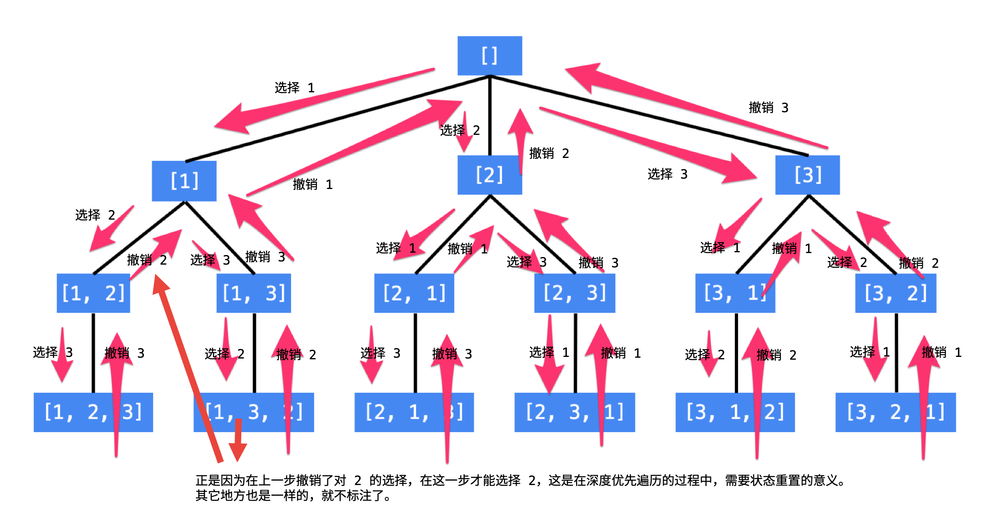
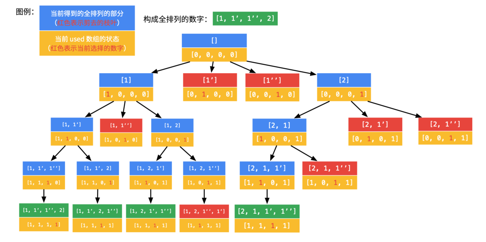
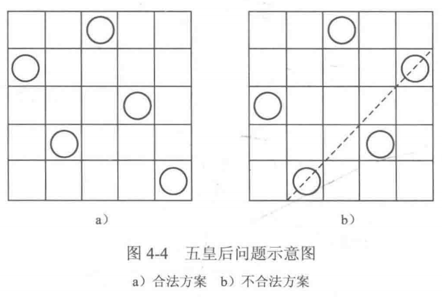

# 递归

## 分治

步骤：分解，解决，合并。

## 递归

### 求n!

```c++
#include <iostream>
int F(int n){
    if(n == 0) return 1; // 当达到递归边界F(0)时，返回F(0) == 1
    else return F(n - 1) * n; // 没有到达递归边界时，使用递归式递归下去
}

int main(){
    int n;
    cin >> n;
    cout << F(n) << endl;
    return 0;
}
```

### 求Fibonacci数列

```c++
#include <iostream>
int F(int n){
    if(n == 0 || n == 1) return 1; // 递归边界
    else return F(n - 1) + F(n - 2);  // 递归式
}
int main(){
    int n;
    cin >> n;
    cout << F(n) <<endl;
    return 0;
}
```

### 全排列

要求找到一排数字的全部排列组合。



```c++
#include <iostream>
const int maxn = 11;
// p为当前排列， hashTable记录整数x是否已经在p中
int n, P[maxn], hashTable[maxn] = {false};
// 当前处理排列的第index号位
void generateP(int index){
    if(index == n + 1){   //递归边界，已经处理完排列的1~n位
        for(int i = 1; i <= n; i++){
            cout << P[i] << endl; //输出当前排列
        }
        return;
    }
    for(int x = 1; x <= n; x++){  // 枚举1~n，试图将x填入P[index]
        if(hashTable[x] == false){  // 如果x不在P[0]~P[index-1]中
            P[index] = x;  // 令P的第index位为x，即把x加入当前排列
            hashTable[x] = true; //记x已在P中
            generateP(index + 1); //处理排列的第index + 1号位
            hashTable[x] = false; //已处理完P[index]为x的子问题，还原状态
        }
    }
}
int main(){
    n = 3; // 欲输出1~3的全排列
    generateP(1); // 从P[1]开始填
    return 0；
}
```



### n皇后问题

在全排列的基础上查出在n*n的国际象棋棋盘上放置n个皇后，使两个皇后不在同一行，同一列、同一对角线上的所有合法方案



#### 暴力算法

```c++
int count = 0;
void generateP(int index){
    if(index == n + 1){   // 递归边界，生成一个排列
        bool flag = true; // flag 为true表示当前排列为一个合法方案
        for(int i = 1; i <= n; i++){  // 遍历任意两个皇后
           for(int j = i + 1; j <= n; j++){
               if(abs(i - j) == abs(P[i] - P[j])){ // 如果在一条对角线
                   flag = false; // 不合法 
               }
           }
        }
        if(flag) count++; // 若当前法案合法，令count加1
        return；
    }
    for(int x = 1; x <= n; x++){
        if(hashTable[x] == false){
            P[index] = x;
            hashTable[x] = true;
            generateP(index + 1);
            hashTable[x] = false;
        }
    }
}
```

#### 回溯法

```c++
void generateP(int index){
    if(index == n + 1){ // 递归边界，生成一个合法方案
        count++; // 能到达这里的一定是合法的
        return;
    }
    for(int x = 1; x <= n; x++){ // 第x行
        if(hashTable[x] == false){ // 第x行还没有皇后
            bool flag = true; // flag为true表示当前皇后不会和之前的皇后冲突
            for(int pre = 1; pre < index; pre++){ // 遍历之前的皇后
                // 第index列皇后的行号为x，第pre列皇后的行号为P[pre]
                if(abs(index - pre) == abs(x - P[pre])){
                    flag = false; // 与之前的皇后在一条对角线，冲突
                    break;
                }
            }
            if(flag){ // 如果可以把皇后放在第x行
                P[index] = x; // 令第index列皇后的行号为x
                hashTable[x] = true; // 第x行已被占用
                generateP(index + 1); //递归处理第index+1行皇后
                hashTable[x] = false; //递归完毕，还原第x行为未占用
            }
        }
    }
}
```

